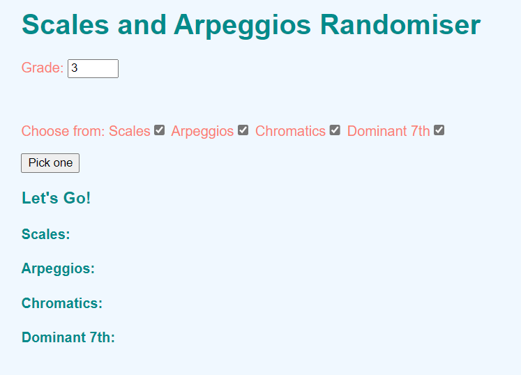
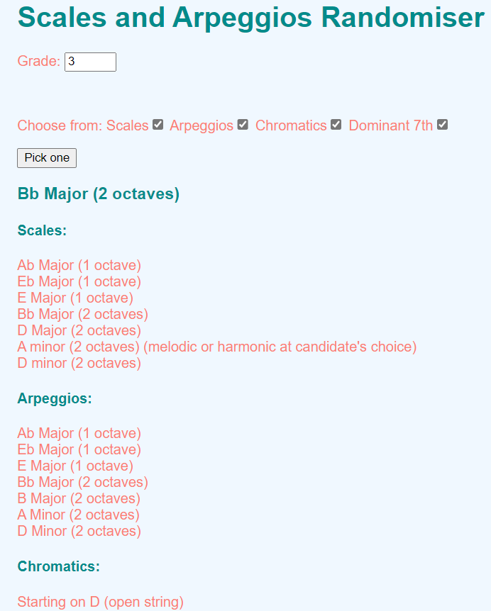
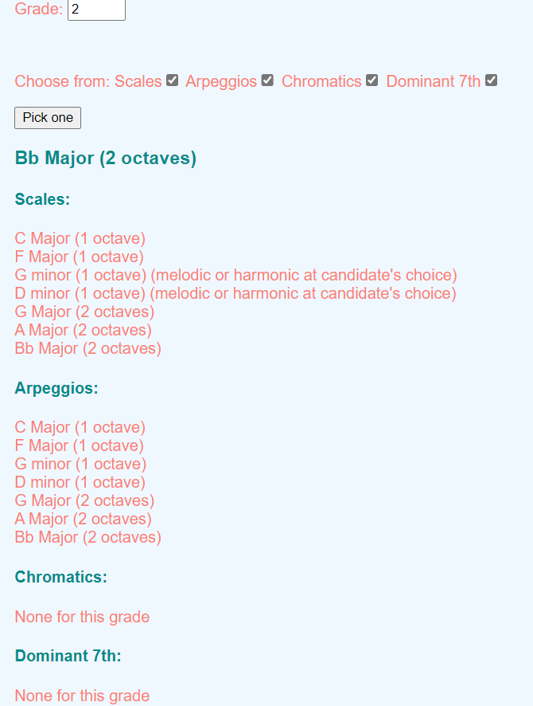
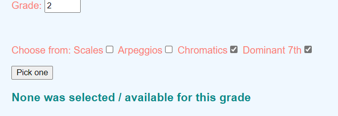

# Scales and Arpeggios Randomiser

It is to generate a scale / arpeggio / chromatic from the ABRSM syllabus for young violinist to choose to practise.

At the same time, it is a project enough for me to test different things. I have recently added automatic testing using GitHub Actions.

## To clone and install
```
git clone https://github.com/michaelcychan/scales-arpeggios-randomiser.git
cd scales-arpeggios-randomiser
npm install
```

## To generate bundle.js
```
npm run build
```
Keep this terminal open  

## To run test
```
npm run test
```

## Screenshots
<p>
<br>
<em>Starting Screen</em>
</p>

<p>
<br>
<em>Give a random scale according to checkboxes and generating the full list</em>
</p>

<p>
<br>
<em>User is informed some lists are empty for certain grades</em>
</p>

<p>
<br>
<em>User is informed if he wants a random scale from empty lists</em>
</p>

## To edit the list
The List of scales is stored in gradeList.json in JSON format. The file structure is as follows:

```
{
  "2": {
    "scales": [
      "C Major (1 octave)",
      "F Major (1 octave)",
      ...
    ],
    "arpeggios": [
      "C Major (1 octave)",
      ...
    ],
    "chromatics": [
      ...
    ], 
    "dominant7th": [
      ...
    ]
  },
    "3": {
    "scales": [
      ...
    ],
    "arpeggios": [
      ...
    ],
    "chromatics": [
      ...
    ], 
    "dominant7th": [
      ...
    ]
  }
}
```

## To Do list
- [X] Allow to generate the full list for grade 3  
- [X] Contains Scales, Arpeggios, chromatics, and Dominant 7th.  
- [X] Allow to print a random scale for grade 3  
- [X] Limit grade level from 1 to 8   
- [ ] Expand the list from grade 1 to 8 (Currently only grade 2 - 4)  
- [X] Add Styling  
- [X] Inform user if the grade / list pair contains nothing.
- [X] Add GitHub Actions to do automatic testing upon push